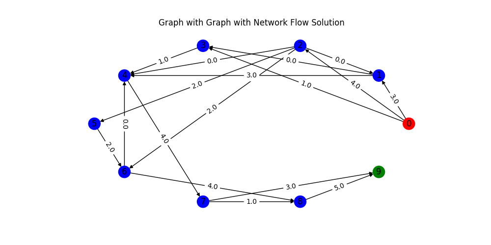

# Linear Programming: Diet and Network Flow Problems

This repo contains two small optimization examples using Python.

- **Diet problem** (`diet_problem/`): minimize diet cost while meeting nutrient bounds.
- **Network flow problem** (`network_flow_problem/`): model and visualize max flow on a directed graph.

## Requirements

```bash
python -m pip install -r requirements.txt
```

## Run the diet solver

From repo root:

```bash
python diet_problem/diet_and_nlps.py
```

## Run a network flow sample (without editing source)

From repo root:

```bash
python - <<'PY'
from network_flow_problem.network_flow_graph import WeightedDirectedGraph
from matplotlib import pyplot as plt

G = WeightedDirectedGraph(10, 0, 9)
G.add_edge(0, 1, 3); G.add_edge(0, 2, 4); G.add_edge(0, 3, 1)
G.add_edge(1, 3, 1); G.add_edge(1, 4, 4)
G.add_edge(2, 1, 3); G.add_edge(2, 4, 2); G.add_edge(2, 5, 2); G.add_edge(2, 6, 2)
G.add_edge(3, 4, 2)
G.add_edge(4, 7, 4)
G.add_edge(5, 6, 2)
G.add_edge(6, 4, 2); G.add_edge(6, 8, 4)
G.add_edge(7, 8, 3); G.add_edge(7, 9, 3)
G.add_edge(8, 9, 5)

G.solve_flow_problem()
G.visualize_graph(viz_flow=True)
plt.show()
PY
```

## Sample graph output


